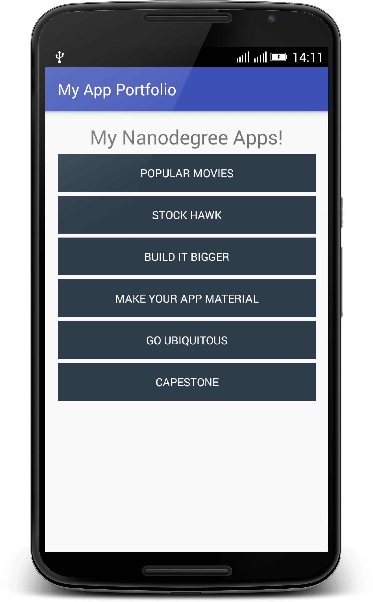

# My Portfolio

This is an android application made for submission in "Project: 0" of Udacity android Nanodegree course

## Feature

It opens up showing 6 project names which will be made during the course. On clicking those names, a toast message is shown.

## Screenshot

